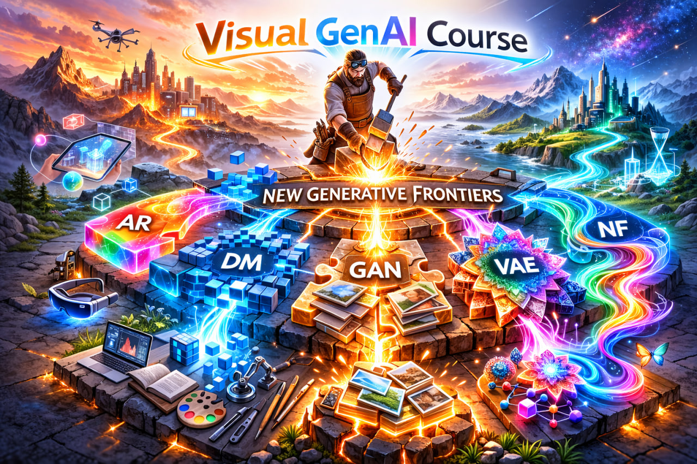

### Description

In this course, we thoroughly study generative paradigms widely adopted for visual domain generation: images, videos, 3D. The main focus is on diffusion models: their different theoretical interpretations, as well as advanced training and sampling methods that ensure high quality and fast generation. Special attention is given to few-step diffusion-based generative models, which are widely used today in production services for image and video generation. We also examine recent advances in autoregressive image generation and their effective synergies with diffusion models.

Goals: 

* Deep understanding of leading generative models
* a current status of the field at the latest moment: which paradigms and ideas are widely used today in state-of-the-art generative appraoches.

### Syllabus

1. **Introduction to Diffusion Models:** Denoising Diffusion Probabilistic Models (DDPMs) & Denoising Score Matching (DSM)  
2. **Continuous Diffusion Models:** Probability Flow ODE and SDE formulations  
3. **Flow Matching** and its connection to diffusion models  
4. **Efficient PF-ODE/SDE solvers:** Euler methods, DDIM, and DPM-Solver  

5. **Diffusion Models in Practice:** diffusion spaces, most recent architectures, design choices, training and sampling techniques  
6. **Flow Map Models**: learnable PF-ODE integrators for faster sampling. (Consistency Models, MeanFlow)  
7. **Distribution Matching** for few-step generators (DMD, ADD, SwD, Drifting).  
8. **Video Generation**: architectures and challenges.
9. **Efficient ~~DL~~ Diffusion Models**: model-level optimizations (caching, sparse attention, etc.)  
10. **Autoregressive Visual Generation:** discrete image tokenizers VQ-VAE/VQ-GAN, scale-wise models (VAR, Switti), continuous AR models (MAR)  
11. **Multimodal Generative Models:** architectures and training setups  
12. **3D Generative Models:** intro to 3D modeling and multi-view diffusion models  

### Contacts

[Dmitry Baranchuk](dmitrybaranchuk@gmail.com) or [Nikita Starodubcev]() 

### Course staff

* [Dmitry Baranchuk](https://dbaranchuk.github.io/)
* [Nikita Starodubcev](https://scholar.google.com/citations?user=o6pRm_gAAAAJ&hl=en)
* [Denis Rakitin](https://scholar.google.com/citations?user=zIl8Z3gAAAAJ&hl=en)
* [Denis Kuznedelev]()
* [Ilya Drobyshevsky]()
* [Ilya Sudakov]()
* [Sergey Kastrulin]() 
* [Kirill Struminsky]()

### References

* Referring to [CS236](https://deepgenerativemodels.github.io/) by Stefano Ermon for the introduction to diffusion models
* Some explanations are inspired by [The Principle of Diffusion Models](https://the-principles-of-diffusion-models.github.io/)