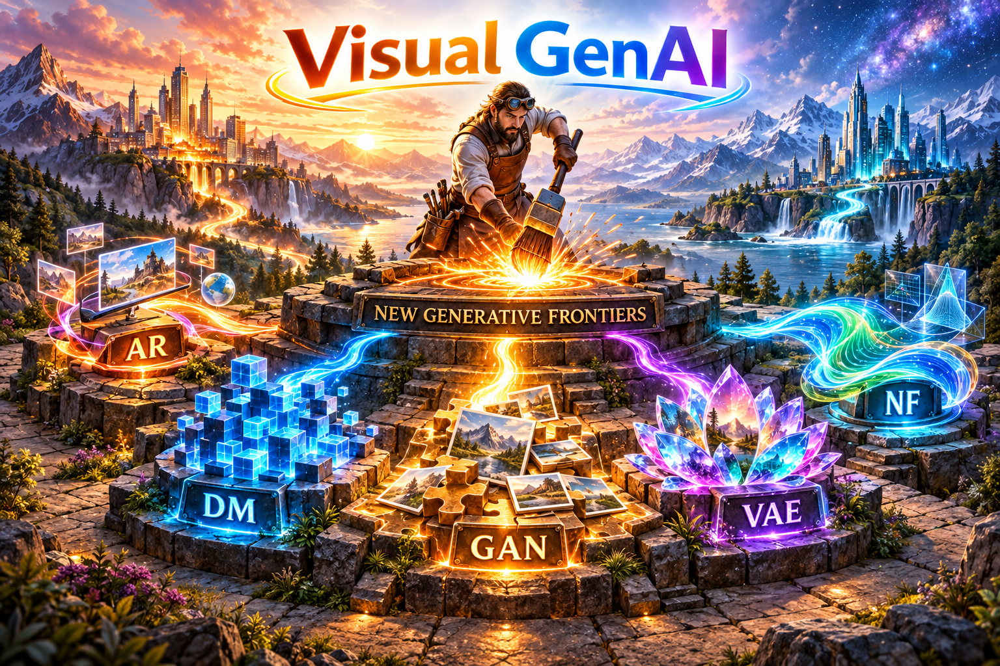

# Visual GenAI Course

<p align="center">

</p>

<p align="center">
  <a href="#syllabus"></a>
  <a href="#assignments"></a>
  <a href="#exam"></a>
  
</p>

A graduate-level course on modern generative modeling for visual domains — **images, video, and 3D**.
The main focus is on **diffusion models**: their theoretical interpretations and the advanced
training and sampling methods behind today's high-quality, fast generators. Special attention is
given to **few-step** diffusion-based models used in production image/video services, and to recent
advances in **autoregressive** visual generation and its integration with diffusion.

## Goals

* Develop a deep understanding of leading visual generative paradigms.
* Learn novel, effective diffusion-based generative frameworks.
* Master the most recent training and inference techniques behind state-of-the-art generative models.

## Contents

* [Syllabus](#syllabus)
* [Study with the course tutor](#study-with-the-course-tutor)
* [Research Seminars on Diffusion Models](#research-seminars-on-diffusion-models)
* [Assignments](#assignments)
* [Exam](#exam)
* [Contacts](#contacts)
* [Course staff](#course-staff)
* [References](#references)

<hr>

## Syllabus

Each lecture comes with English slides (`.pdf` in this repo) and a recorded lecture/seminar (RU).

|  # | Topic | Materials |
|:--:|-------|-----------|
|  1 | **Introduction to Diffusion Models** — Denoising Diffusion Probabilistic Models (DDPMs) & Denoising Score Matching (DSM) | [Slides](course_materials_spring_2026/week1_ddpm_dsm/ddpm_dsm_lecture.pdf) · [Lecture (RU)](https://disk.yandex.ru/i/kkxLSdtAVcVxgw) · [Seminar (RU)](https://disk.yandex.ru/i/D_2_7Wj-ym4QEQ) |
|  2 | **Continuous Diffusion Models** — Probability Flow ODE and SDE formulations | [Slides](course_materials_spring_2026/week2_continuous_time_diffusion/continuous_time_diffusion_lecture.pdf) · [Lecture (RU)](https://disk.yandex.ru/i/YkIe5QbG7CdorA) |
|  3 | **Flow Matching** and its connection to diffusion models | [Slides](course_materials_spring_2026/week3_flow_matching_and_solvers/flow_matching_lecture.pdf) · [Lecture (RU)](https://disk.yandex.ru/i/jAJW937u__lmtg) |
|  4 | **Efficient PF-ODE/SDE Solvers** — Euler methods, DDIM, and DPM-Solver | [Slides](course_materials_spring_2026/week3_flow_matching_and_solvers/solvers_lecture.pdf) · [Lecture (RU)](https://disk.yandex.ru/i/DeJsKA1M4Qr9Zw) |
|  5 | **Diffusion Models in Practice** — diffusion spaces, recent architectures, design choices, training & sampling techniques | [Slides](course_materials_spring_2026/week4_practical_dm/practical_dm_lecture.pdf) · [Lecture (RU)](https://disk.yandex.ru/i/rW8GEXnSNN0avQ) · [Seminar (RU)](https://disk.yandex.ru/i/1dVEoOIKN0-4bA) |
|  6 | **Flow Map Models** — learnable PF-ODE integrators for faster sampling (Consistency Models, MeanFlow) | [Slides](course_materials_spring_2026/week5_few_step_models_flow_maps/few_step_flow_map_lecture.pdf) · [Lecture (RU)](https://disk.yandex.ru/i/ESwQxH5EXe3f5g) · [Supplementary](course_materials_spring_2026/week5_few_step_models_flow_maps/flow-map-summary.pdf) |
|  7 | **Distribution Matching** for few-step generators (DMD, ADD, SwD, Drifting Models) | [Slides](course_materials_spring_2026/week6_few_step_models_distribution_matching/distribution_matching_lecture.pdf) · [Lecture (RU)](https://disk.yandex.ru/i/XGViuRbTRNBeDg) |
|  8 | **Autoregressive Visual Generation** — discrete tokenizers VQ-VAE/VQ-GAN, scale-wise models (VAR, Switti), continuous AR (MAR), diffusion as AR | [Slides](course_materials_spring_2026/week7_visual_ar_models/visual_ar_models_lecture.pdf) · [Lecture (RU)](https://disk.yandex.ru/i/3dE0XlI793U_DA) |
|  9 | **Video Generation** — architectures, challenges, and AR video diffusion models | [Slides](course_materials_spring_2026/week8_video_diffusion_and_efficient_genai/video_generation_and_efficient_genai_lecture.pdf) · [Lecture (RU)](https://disk.yandex.ru/i/ITGNF6ukuy1ufQ) · [Seminar (RU)](https://disk.yandex.ru/i/DPQkF553n4rkeg) |
| 10 | **Efficient Diffusion Models** — model-level optimizations (caching, sparse attention, quantization, …) | [Slides](course_materials_spring_2026/week8_video_diffusion_and_efficient_genai/video_generation_and_efficient_genai_lecture.pdf) · [Lecture (RU)](https://disk.yandex.ru/i/ITGNF6ukuy1ufQ) |
| 11 | **Multimodal Generative Models** — architectures, training setups, and conditioning in diffusion (ControlNet, IP-Adapter) | [Slides](course_materials_spring_2026/week9_multimodal_generation_and_conditioning/multimodal_generation_and_conditioning.pdf) · [Lecture (RU)](https://disk.yandex.ru/i/EVl_Y3fF0KL8SA) |
| 12 | **3D Generative Models** — intro to 3D modeling and multi-view diffusion models | [Slides](course_materials_spring_2026/week10_3d_generative_models/3d_generative_models_lecture.pdf) · [Lecture (RU)](https://disk.yandex.ru/i/kAUxkOnFmZxJmw) |

<hr>

## Study with the course tutor

The **Visual GenAI Course Tutor** skill helps you find lectures and prerequisites,
understand equations, work through assignments, and prepare for the exam. It asks
Codex to read the relevant course files and cite slide pages or notebook sections.
You can ask questions in English or Russian.

### Get started

1. Clone this repository, or update your existing checkout, and open its root folder
   in **Codex CLI or the Codex IDE extension**.
2. The skill is included in
   [`.agents/skills/visualgenai-course-tutor/`](.agents/skills/visualgenai-course-tutor/SKILL.md).
   Codex discovers skills in this repository folder; no separate skill installation
   is needed. See the [official skill documentation](https://learn.chatgpt.com/docs/build-skills).
3. Type `$` and select `visualgenai-course-tutor`, or include its name in your prompt:

```text
$visualgenai-course-tutor
Help me understand flow matching before HW3.
I know DDPM, but velocity prediction is confusing.
Use the course notation, show a small example, then quiz me.
```

If the skill does not appear, restart Codex after opening the repository.

### What to ask

| Goal | Example prompt after selecting the skill |
|---|---|
| Find prerequisites | “Which lectures and sections should I revisit before HW4?” |
| Understand a derivation | “Explain the MeanFlow target in the slides, including the time convention.” |
| Get homework help | “Read my attempt at this exercise and give me one hint at a time.” |
| Debug an implementation | “Check the timestep direction and tensor shapes in my sampler; start with a small example.” |
| Plan your study | “I have four hours this week. Plan reading and practice for flow matching.” |
| Prepare for the exam | “Quiz me on the official exam topics, one question at a time, and give feedback.” |

For homework, point to the exercise and show your attempt. The tutor is instructed
to build on your work and leave solution notebooks unopened unless requested.
Recording links help you find lectures; the skill has no built-in transcripts.

<hr>

## Research Seminars on Diffusion Models

* [Searchable seminar index](research_seminars/INDEX.md) — browse 151 entries by topic, paper title, speaker, or date.
* [Seminar recording archive (2023–2026)](research_seminars/diffusion_research_seminars_09_2026.pdf) — English guide; Zoom recordings in Russian.
* [Seminar slides](research_seminars/slides/)
* [Research seminar Telegram group](https://t.me/+gE2ERaknHecyMjZi)

### Research seminar assistant

The [Diffusion Research Seminars skill](.agents/skills/diffusion-research-seminars/SKILL.md)
helps you find relevant talks, plan prerequisite reading, compare papers, and prepare
discussion questions. It is included in this repository and uses the same
[Codex setup as the course tutor](#get-started). Select `$diffusion-research-seminars`:

```text
$diffusion-research-seminars
Find seminars on diffusion language models and suggest a reading order.
I know image diffusion but am new to text generation.
Link the recordings and explain which papers I should read first.
```

Other examples:

* “Find the seminar covering MeanFlow and prepare a reading guide from its paper.”
* “Find the DMD and consistency-model talks, compare their objectives, and cite the papers.”
* “Suggest discussion questions and possible follow-up experiments for this seminar.”

The skill uses the archive to locate talks and reads linked papers for technical
explanations. Claims about what a speaker said, and recording timestamps, require
accessible recording content or transcripts. The current archive includes recording
links and paper references; the slides folder is a placeholder.

<hr>

## Assignments

Homeworks live in [`course_materials_spring_2026/assignments/`](course_materials_spring_2026/assignments). Each contains a starter notebook (and a `task.pdf`
/ `theory.pdf` where applicable).

|  # | Topic | Starter |
|:--:|-------|---------|
| 1 | Intro to diffusion: DDPM & DSM | [`hw1/`](course_materials_spring_2026/assignments/hw1_diffusion_fundamentals) — `practice_template.ipynb`, [`task.pdf`](course_materials_spring_2026/assignments/hw1_diffusion_fundamentals/task.pdf) |
| 2 | Efficient solvers: DPM-Solver | [`hw2/`](course_materials_spring_2026/assignments/hw2_diffusion_solvers) — `practice_dpm_solver.ipynb`, [`theory.pdf`](course_materials_spring_2026/assignments/hw2_diffusion_solvers/theory.pdf) |
| 3 | Flow Matching training | [`hw3/`](course_materials_spring_2026/assignments/hw3_flow_matching) — `fm_training.ipynb` |
| 4 | Flow Map Models | [`hw4/`](course_materials_spring_2026/assignments/hw4_flow_maps) — `flow_map_models.ipynb` |
| 5 | Distribution matching: ADD / MMD distillation | [`hw5/`](course_materials_spring_2026/assignments/hw5_distribution_matching) — `add_mmd_distillation.ipynb` |
| 6 | Autoregressive generation: MAR with a flow-matching head | [`hw6/`](course_materials_spring_2026/assignments/hw6_masked_ar) — `mar_fm_head.ipynb` |
| 7 | AR video diffusion sampling | [`hw7/`](course_materials_spring_2026/assignments/hw7_video_ar_diffusion) — `ar_video_diffusion_sampling.ipynb` |

<hr>

## Exam

The full list of examinable topics is in
[`course_materials_spring_2026/exam/exam_topics_visual_genai.md`](course_materials_spring_2026/exam/exam_topics_visual_genai.md). The
[`course_materials_spring_2026/exam/slot-booking-service/`](course_materials_spring_2026/exam/slot-booking-service) is a small web app students use to book
exam slots (see its own [README](course_materials_spring_2026/exam/slot-booking-service/README.md)).

<hr>

## Contacts

* [Dmitry Baranchuk](mailto:dmitrybaranchuk@gmail.com) — Telegram [@vernold](https://t.me/vernold)
* [Nikita Starodubcev](mailto:jke013333@gmail.com) — Telegram [@nikitastariy](https://t.me/nikitastariy)

## Course staff

* [Dmitry Baranchuk](https://dbaranchuk.github.io/)
* [Nikita Starodubcev](https://scholar.google.com/citations?user=o6pRm_gAAAAJ&hl=en)
* [Denis Rakitin](https://scholar.google.com/citations?user=zIl8Z3gAAAAJ&hl=en)
* [Denis Kuznedelev](https://scholar.google.com/citations?user=L78B2lcAAAAJ&hl=en)
* [Ilya Drobyshevsky](https://scholar.google.com/citations?user=BovM6psAAAAJ&hl=en)
* [Ilya Sudakov](https://scholar.google.com/citations?user=R4hnjs4AAAAJ&hl=en)
* [Sergey Kastrulin](https://scholar.google.com/citations?user=765_fJYAAAAJ&hl=en)
* [Kirill Struminsky](https://scholar.google.com/citations?user=q69zIO0AAAAJ&hl=en)

## References

* The introduction to diffusion models follows [CS236](https://deepgenerativemodels.github.io/) by Stefano Ermon.
* Some explanations are inspired by [The Principles of Diffusion Models](https://the-principles-of-diffusion-models.github.io/).
* Numerous papers and blog posts that led us to this course.
